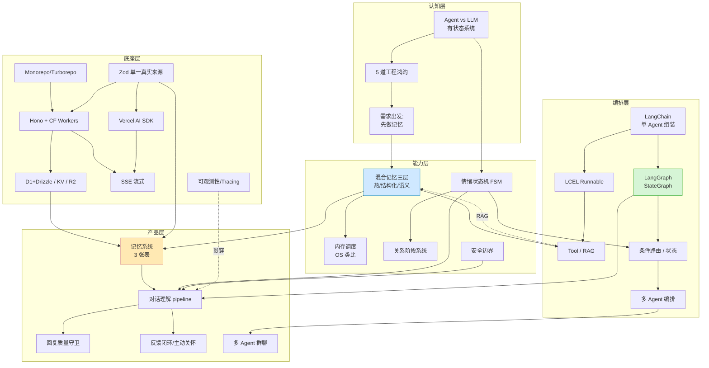
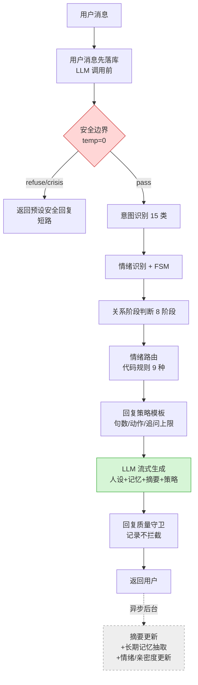
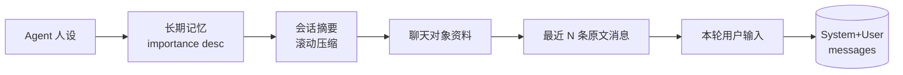

# AI 陪伴 Agent —— 学习计划与知识图谱

> 数据底座：`knowledge-base/`（195 篇，8 大类）
> 目标：从 0 做出一个**有记忆、有情绪、能持续陪伴**的生产级 AI Agent
> 配套设计：见 `02-阶段1-记忆系统设计.md`

---

## 一、整体认知坐标系

这门课不是教「怎么调模型」，而是教「在应用层把模型缺失的能力补回来」。
学习时始终用这 3 条主线给每篇文章定位，避免迷失在细节里：

| 主线 | 它回答的问题 | 对应文章群 |
|---|---|---|
| **能力补全**：记忆 / 情绪 / 安全 / 持久化 | 模型本身没有的，应用层怎么给 | 04, 07, 09, 176–190 |
| **工程底座**：Monorepo / Hono / CF / Zod | 一个能上线、能运营的系统怎么搭 | 62–115 |
| **编排范式**：LangChain / LangGraph | 单步 → 多步 → 多 Agent 怎么演进 | 21–61 |

贯穿全程的设计哲学（务必内化）：
1. **LLM 负责理解，代码负责策略** —— 情绪/意图/记忆抽取交给 LLM；安全决策/路由/约束/质检用确定性代码。
2. **分层治理，而非一个大 Prompt** —— 安全→意图→情绪→关系→路由→策略→生成，每层独立可观测。
3. **关系连续性 > 功能数量** —— 先把「记得用户」做对，别先想多 Agent。

---

## 二、学习计划（6 个学习单元 + 动手里程碑）

> 节奏建议：每个单元先「通读理解 → 跑通最小 Demo → 回看设计动机」。
> 标 ⭐ 的是地基篇，必须吃透；标 ⚡ 的是可按需跳读的工程细节。

### 单元 0 · 认知校准（0.5 天）⭐
- **读**：01（学习心法）、02（什么是 Agent 开发）、03（从需求出发）
- **目标**：能用自己的话说清「Agent vs 普通 LLM 应用」、5 道工程鸿沟（记忆丢失/上下文溢出/情绪断裂/安全失控/无法运营）。
- **里程碑**：写下你要做的 Agent 的「关系目标」一句话。

### 单元 1 · 记忆与调度的设计思想（1 天）⭐
- **读**：04（内存调度）、09（混合记忆架构）、06（向量化与语义检索）、07（情绪状态机）
- **目标**：理解三层记忆（热/结构化/语义）+ OS 内存管理类比（LLM=CPU，上下文=RAM，DB=硬盘）+ FSM 为什么优于「让 LLM 自己判断情绪」。
- **里程碑**：画出你项目的记忆分层表（存什么/存哪/怎么取）。→ **直接进入阶段 1 设计**。

### 单元 2 · 编排范式选型（1 天）⭐
- **读**：05（LangChain/LangGraph）、21–24（框架认知 4 篇）、10（LangGraph Agent 编排）
- **目标**：说清 core / LangChain / LangGraph 三层职责；判断「何时单 Agent、何时上多 Agent」。
- **里程碑**：决定你的 v1 用单 Agent + LangGraph 主图（而非多 Agent）。

### 单元 3 · LangChain 实战（2–3 天）
- **读**：25–43。核心：27（消息协议）、28–30（Prompt/Parser）、31–34（LCEL）⭐、35–36（Memory）⭐、39（RAG）⭐、40–41（Tool）。
- ⚡ 可略读：42（Middleware）、43（Tracing，回看单元 6 再看）
- **里程碑**：用 LCEL 串一条 `prompt → model → parser` 链；用 Output Parser 拿到结构化结果。

### 单元 4 · LangGraph 实战（3–4 天）⭐
- **读**：44–61。核心：45–47（StateGraph/State/条件路由）⭐、48（Checkpointer）、49（ReAct）、50（流式）、52–53（中断/HITL）、58（Store）、60（实战）⭐、61（运行时上下文）。
- ⚡ 多 Agent 暂缓：54–57（子图/Supervisor/Handoff/层级）——v2 再深入。
- **里程碑**：用 StateGraph 搭一个「安全→意图→情绪→路由→生成」的最小主图。

### 单元 5 · 工程底座（按需，3–5 天）
> 这是「让它能上线」的部分，可与上面并行或在需要时回查。
- **Monorepo**（62–75）⚡：理解 workspace + Turborepo 缓存即可。
- **Hono + Cloudflare**（76–101）⭐：78–85（路由/中间件/校验/认证鉴权）、86–89（KV/D1/Drizzle/R2）⭐、91（SSE 流式）⭐、96（Vectorize+RAG）、97（DO+WebSocket）。
- **Zod**（102–115）⭐：103（单一真实来源）、111（类型推导）、113（Zod+Hono）、114（Zod+LLM）⭐、115（端到端实战）。
- **里程碑**：D1 + Drizzle 建表跑通；Hono SSE 把模型输出流式返回前端。

### 单元 6 · Vercel AI SDK + 完整 Agent 实现（5–7 天）⭐⭐
> 这是把前面所有东西「组装成产品」的总装车间，也是阶段 1–4 的代码出处。
- **AI SDK 基础**（116–136）：117（三层架构）、120（消息协议）、122（UIMessageStream）⭐、123（结构化输出）⭐、124–125（Tool/多步）、126（useChat）、130（AI SDK×Hono）⭐、131（缓存限流 Fallback）、132（Telemetry）。
- **项目脚手架 + 认证**（137–175）⚡：按需查，认证链路 148–172 可作为通用后端模板。
- **Agent 大脑**（176–195）⭐⭐⭐ —— **本课精华，反复读**：
  - 记忆系统：176→177→178→179→180→181
  - 对话理解链：182（安全）→183（意图）→184（情绪路由）→185（回复策略）→186（质量守卫）→187（关系阶段）→188（记忆候选）
  - 陪伴机制：189（反馈闭环）、190（主动关怀）
  - 多 Agent 群聊：191–195（v2）
- **里程碑**：跑通「一次对话」的完整 pipeline（对应阶段 1–3）。

---

## 三、四阶段动手路线（与设计文档对齐）

| 阶段 | 目标 | 主要文章 | 产物 |
|---|---|---|---|
| **阶段 1** 记忆地基 | RAG 闭环 + 三层记忆 + Prompt 组装 | 04,09,176–181 | 3 张表 + 组装服务（**见 `02-阶段1`**） |
| **阶段 2** 会回应 | 意图/情绪/关系/路由，从「能答」到「会回应」 | 07,183–187 | 对话理解链节点 |
| **阶段 3** 加护栏 | 安全前置短路 + 质量守卫（只记录不拦截） | 182,186 | 安全节点 + Guard |
| **阶段 4** 主动+成长 | 反馈闭环 + 主动关怀 | 189,190 | 反馈表 + 关怀生成 |

> v2 扩展：向量检索（取代 importance 排序）、多 Agent 群聊（191–195）、模型微调。

---

## 四、知识图谱

### 4.1 概念依赖图（自顶向下，箭头=「依赖/前置」）

### 4.2 「一次对话」运行时编排图（阶段 1–4 的总装）

### 4.3 记忆三层注入 Prompt 顺序

---

## 五、推荐学习节奏

- **快速通关（约 2 周）**：单元 0→1→2→（4 LangGraph）→（6 的 176–190）。工程底座按需查。
- **扎实路线（约 4–5 周）**：0→1→2→3→4→5→6 全过，每单元都跑 Demo。
- **只想动手做产品**：直接读单元 1 + 单元 6 的 176–190，配合本目录设计文档逐阶段实现。

> 下一步：进入 `02-阶段1-记忆系统设计.md`，开始落地三张表 + Prompt 组装。
